# Observability for Apache Kafka

## Introduction

Apache Kafka is a distributed event streaming platform, it is widely used in the industry for building real-time data pipelines and streaming applications.

This project is a demonstration of how to implement observability for Apache Kafka cluster using Prometheus and Grafana.

## Architecture

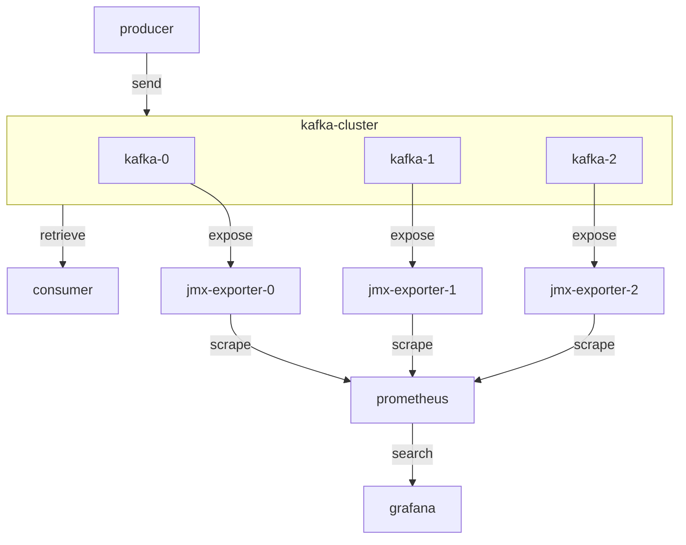

## Setup

In this section, we will setup all the components, including Apache Kafka, Prometheus, Grafana, and JMX Exporter.

Requirements:

- Linux (Ubuntu)
- Docker
- Docker Compose

1. Create a new docker network for this stack.

```bash
docker network create kafka-o11y
```

2. Pull and build required docker images.

```bash
make build
```

3. Setup Kafka cluster and all the exporters. This project use KRaft mode, so that we don't need Zookeeper.

```bash
make deploy-kafka
```

4. Setup Prometheus and Grafana, configuration file has been provided in `./prometheus` and `./grafana` directories and auto-loaded by the services.

```bash
make deploy-o11y
```

5. Setup the Kafka consumer.

Consumer receives the top command output from kafka and print the 5 processes with the highest CPU usage.

```bash
make deploy-consumer
```


6. Send top command output to Kafka.

>> WARNING: Linux only, because the top command output is different on macOS.

You can press `space` to accerlate the output, and `ctrl+c` to stop the producer.

```bash
top | docker run --rm -i --network kafka-o11y kafka-producer python app.py
```

7. Clean up the stack.

This command will stop and remove all the services, including all the volumes (docker network is not removed).

```bash
make clean
```

## Usage

Access the Grafana dashboard at `http://localhost:3001`, and login with `admin` and default password `admin`.

Check the prometheus scrape targets at `http://localhost:9090/targets`.

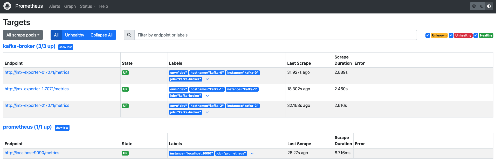

### Dashboard

There are three dashboards provided in this project, `Kafka Cluster`, `Kafka Topics`, and `KRaft`.

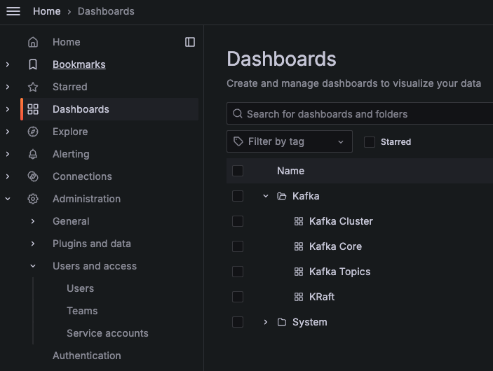

#### Kafka Cluster

`Kafka Cluster` dashboard shows some aspects of the Kafka cluster, including Network, Disk, Connection, Producer, and Consumer etc. I choose some important sections to show here.

`Overview` section provides a high-level overview of the cluster's health and operational status, including the number of online controller, brokers and partitions.

If `Unclean Leader Election Rate`, `Under Replicated Partitions` and `Under Min ISR Partitions` metrics greater than zero, it indicates potential availability and data loss, because ISR (In-Sync Replicas) is not enough, the data is not replicated to the required number of replicas.

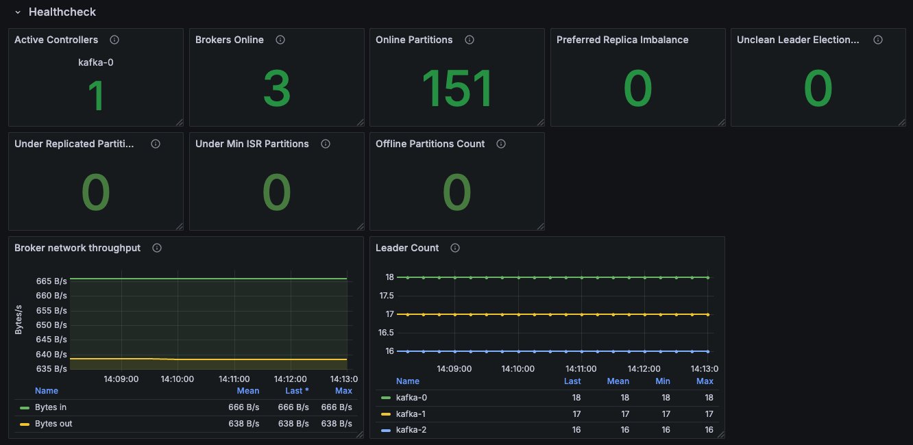

`Request rate` section shows the number of requests, including produce, fetch, and fetch consumer requests. It helps us to understand the cluster's workload.

If the request rate is too high, it may cause the broker to be overloaded, and the request rate is too low, it may indicate that the producer or consumer is not working properly.

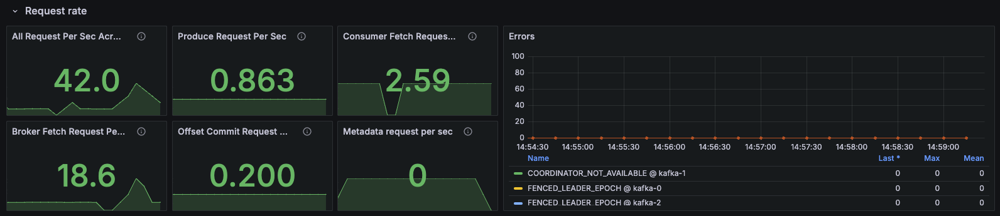

`System` section shows the Disk read/write bytes. It helps us to understand the disk usage.

If some brokers have a high disk read/write bytes, it may indicate that the broker is overloaded.

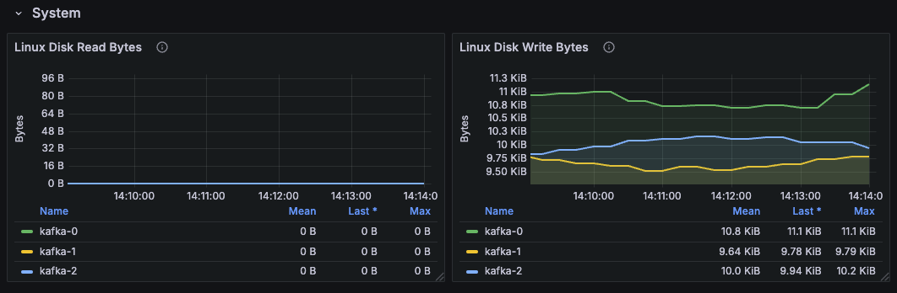

`Throughput In/Out` section shows the number of bytes read/written per second, while broker goes down, we can quickly identify the issue.

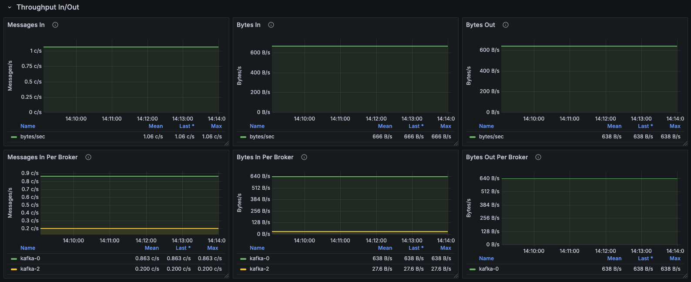

`Logs size` section shows the size of the log files. If the log size is too large, it may indicate that disk space is insufficient.

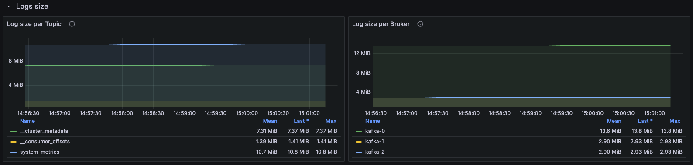

`Isr Shrinks / Expands` section shows the number of ISR shrinks and expands, it helps us to understand the ISR status.

ISR shrinks means that some replicas are not in sync with the leader, frequent ISR shrinks and expands may indicate network issues.

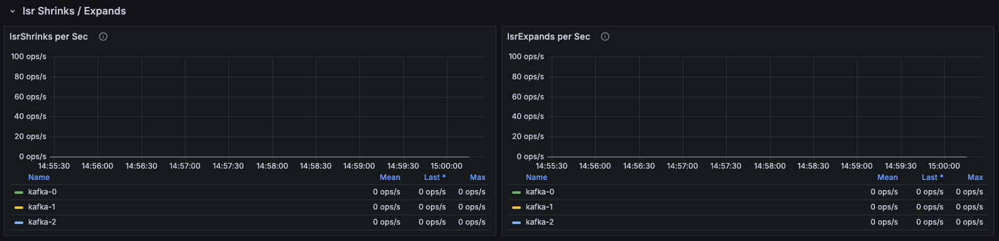

#### Kafka Topics

This dashboard shows the metrics of Kafka topics, including total number of partitions, the number of bytes Read/Write, data produced/consumed per topic.

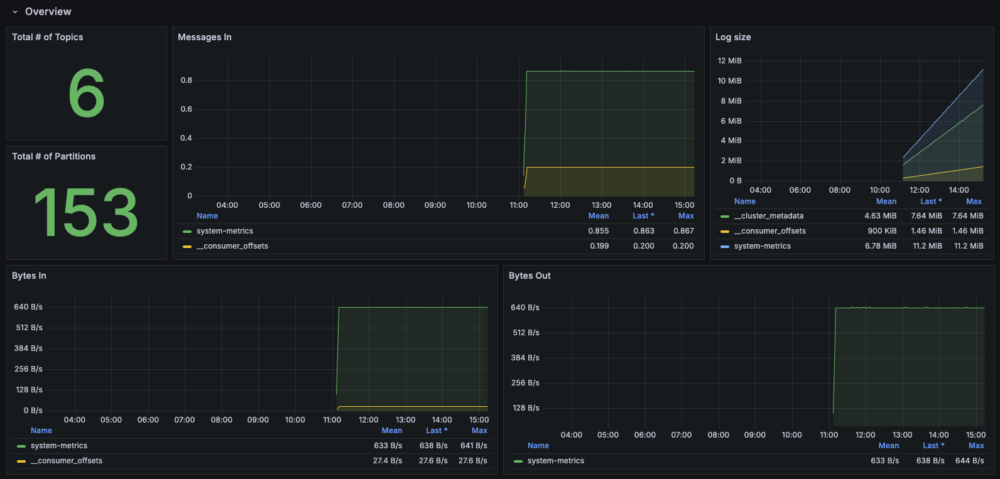

#### KRaft

This dashboard shows the metrics of KRaft mode, including the record append/fetch rate by the leader of the raft quorum, time spent to commit a record.

If the latency of the raft commit is increasing, it may indicate that the cluster metadata synchronization issue.

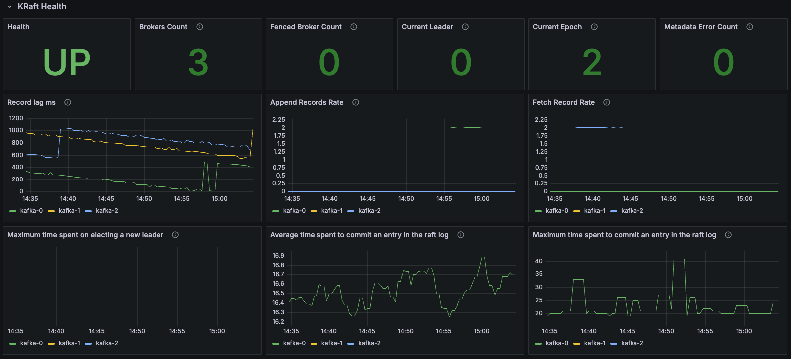

## References

[Monitoring Kafka with JMX | Confluent Documentation](https://docs.confluent.io/platform/current/kafka/monitoring.html)

[confluentinc/jmx-monitoring-stacks: 📊 Monitoring examples for Confluent Cloud and Confluent Platform](https://github.com/confluentinc/jmx-monitoring-stacks)

[prometheus/jmx_exporter: A process for collecting metrics using JMX MBeans for Prometheus consumption](https://github.com/prometheus/jmx_exporter)
